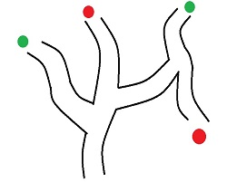

# Car++ 🚗 

## Description

The ultimate goal of the project to create a self driving car. There are a few sensors on the car:

* LIDAR 
* 8 RGB sensors on a multiplexer
* 3 ultrasonic range detectors
* Inertial measurement unit
* Hall effect sensor

Based on the sensor feedback, the car has to control the wheels with a servo, communicate with the motor through
an H-bridge, control addressable LEDs which represent brake lights and turn indicators, and send diagnostics via 
bluetooth connection.

The controlling software runs on an STM32F746GZ-NUCLEO board.

## Technologies

 * Embedded C
 * STM32 Hadrdware Abstraction Layer
 * FreeRTOS
 * Ceedling test framework
 
## Features

Since there are typically more teams working with the same car, the project can be approached from 2 different ways

### Line following

 

With this approach the key feature of the car that it's able to follow a colored duct tape by constantly checking
which RGB sensors sees the line. After this key feature is done, the project might go towards more complicated features:

* Receive commands via bluetooth
* Different speed on different colors
* Follow lines in reverse
* Stop in case there is an obstacle ahead
* Continue route if obstacle is removed
* Light break lights when slowing
* Find exits in a graph(built by colored lines) with no cycles with breadth-first search
* Go for the nearest exit in a graph that the car already traversed
* Find exits in a graph with cycles
* Go for the nearest exit in a graph that the car already traversed
* Indicate turn with the LEDs when turning at a graph node.

### Obstacle avoidance

 

With this approach the key feature of the car that it's able to follow a route blocked by obstacles at both sides by
constantly checking the distance of the walls with LIDAR. After this key feature is done, the project might
go towards more complicated features:

* Receive commands via bluetooth
* Different speed on wider and thicker roads
* Follow track in reverse
* Stop in case there is an obstacle ahead
* Continue route if obstacle is removed
* Light break lights when slowing
* Find exits in a graph(built by walls) with no cycles with breadth-first search
* Go for the nearest exit in a graph that the car already traversed
* Find exits in a graph with cycles
* Go for the nearest exit in a graph that the car already traversed
* Indicate turn with the LEDs when turning at a graph node.

## Milestones

| Week | Milestone                                                                      |
| -----|:------------------------------------------------------------------------------:|
| 2    | Hardwares are working well                                                     |
| 4    | Data structures and complete interfaces for hardwares                          |
| 5    | The car is able to follow a single track having curves                         |
| 7    | The car is able to discover a whole track with crossroads, exits and dead ends |

## Hardwares

### Development board

* [STM32F746GZ-NUCLEO Databrief](resource/docs/stm32_databrief.pdf)
* [STM32F746GZ-NUCLEO User manual](resource/docs/stm32_user_manual.pdf)
* [STM32F7XX MCU Brief manual](resource/docs/stm32_brief_manual.pdf)
* [STM32F7XX MCU Reference manual](resource/docs/stm32_reference_manual.pdf) 

### Bluetooth

* [RN41 bluetooth module Datasheet](resource/docs/rn41_bluetooth_datasheet.pdf)

### HALL

* [A3213 HALL Datasheet](resource/docs/A3213_hall_datasheet.pdf)

### Inertial measurement unit

* [BNO055 IMU Datasheet](resource/docs/BNO055_imu_datasheet.pdf)

### LED

* [WS28212b LED Datasheet](resource/docs/ws2812b_led_datasheet.pdf)

### LIDAR

* [RPLIDAR A1 User manual](resource/docs/rplidarA1_user_manual.pdf)
* [RPLIDAR A1 Datasheet](resource/docs/rplidarA1_datasheet.pdf)
* [RPLIDAR A1 Communication protocol](resource/docs/rplidarA1_communication_protocol.pdf)

### H-Bridge Motor driver

* [vnh5019 Motor driver Datasheet](resource/docs/vnh5019_motor_driver_datasheet.pdf)

### RGB sensor

* [Avago APDS 9960 Datasheet](resource/docs/Avago_APDS_9960_datasheet.pdf)
* [tca9548a multiplexer Datasheet](resource/docs/tca9548a_multiplexer_datasheet.pdf)

### Servo

* [HD1160A Servo Datasheet](resource/docs/HD1160A_servo_datasheet.pdf)

### Ultrasonic range detector

* [HCSR04 Ultrasonic range detector Datasheet](resource/docs/HCSR04_ultrasonic_datasheet.pdf)
